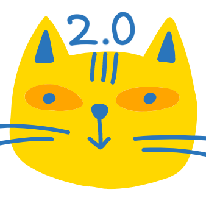

# Modulémon-Advanced-AI
Fork of our 4th semester project at SDU. Game is migrated to Java 18 without OSGi and dynamic components. Used for the Advanced AI for Games course E23 @ SDU

This project is codenamed Modulémon 2.

## Authors
* [Alexander Vinding Nørup](https://github.com/AlexanderNorup)

* [Rasmus Jacobsen](https://github.com/ras-e)

* [Victor Andreas Boye](https://github.com/VictorABoye)

### Original Authors (4th. semesterproject)
* [Alexander Vinding Nørup](https://github.com/AlexanderNorup)

* [Jonas Solhaug Kaad](https://github.com/JonasKaad)

* [Magnus Kjær Sørensen](https://github.com/magnuskjaer)

* [Victor Andreas Boye](https://github.com/VictorABoye)

* [Gorm Emil Smedegaard Krings](https://github.com/Gorm2303)

* [Sebastian Christensen Mondrup](https://github.com/SebMon)
